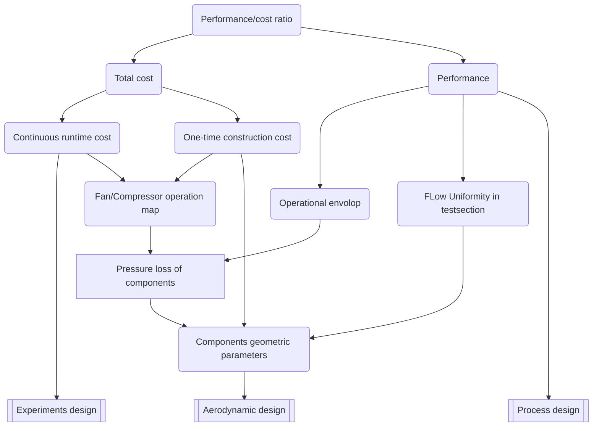

# Design and Implementation of Wind Tunnel Deisgn Domain Specific Language: pipeflow

## Working process with backward!
1. write for press conference
2. write manual
3. write requirements
4. write test suites
5. write libraries
6. write GUI

## Press Conference
Here we proudly anounce a DSL for wind tunnel aerodynamic design, pipeflow.

It represents excellent aerodyanmic deisgn of wind tunnels as compilable & runnable program!
It enables systematically exploring design space of wind tunnels.
It boosts robustness and edgeness of next generation wind tunnel design.

Wind tunnel design to run!
Wind tunnel design to git!
Wind tunnel design to reuse!


## Domain analysis
Wind tunnel design results are geometric definitions fo a tunnel circuit, where wind tunnel components are defined, the geometric parameters are specified for each components, the connection relationship between components is defined. For all the operational conditions, the performance of the tunnel circuit and components will be prodicted to specified design requirements of the fan/compressor. At some point, the fan map wille be presented as the start point to design the fan. At the first design phase, the aerodynamic design of the fan will not be included.

### operational conditions & operational envolop


### geometry
Wind tunnel components are very simple things, they are just pipes, with inlet (inflow intersection), outlet (outflow intersection), profile (a series of intersections along its length).

$$
    \mathcal{S}_i = \mathcal{S}_i(r), ~\mathrm{for}~ r \in [0, L_i]
$$

where $\mathcal{S}_i(r)$ is a simply-connected 2D area ($\Omega$) by closed curve ($\partial \Omega$) in $xy$-plane.

Perimeter and area are as follows:
$$
C = \int_{\partial\Omega} ds
$$
where $s$ denotes the arc length on the curve $\partial\Omega$, starting and ending at any arbitrary point on $\partial\Omega$.

$$
A = \int_\Omega dxdy
$$
Hydraulic diameter will be:
$$
D = \frac{4A}{C}
$$

For any intersection, a two dimensional shape can be defined as the flow area, usually circle, rectangle, square, or octagon (often referred as cutted rectangle). For the concern of wind tunnel design, the area of the shape, the hydraulic diameter are the two things that matter. 

Only when we consider the pressure loss of pipe component, actual shape of intersection do matters, where a shape coefficient can be defined to express anomolic feature that the shape can affect energy loss when flow through the intersection.

### Pressure loss and other performance indexes
For any component, under the constaint that there is no separation in it, the pressure loss coefficient (local or reduced by nomolization of testsection dynamic pressure) is the primary design drive.
For setting chamber, contraction (\& plus nozzle), and testsections, there are also uniformity indexes.
There are noise performance for specific types of wind tunnels.
Nevertheless, pressure loss is the primary performance loss for almost all components in windtunnel circuit.

Taking construction in mind, the aerodynamic design also partially determines the construction cost of a wind tunnel.
And pressure losses are essential to derive windtunnel fan map, which determines the most expensive component in the sense of runtime cost of windtunnel experiments.



<div align='center' style="font-size:16px;font-weight:bold;">Fig. 1  Wind tunnel Design Drivers to Aerodynamic Design</div>

As Fig. 1 describes, the aerodynamic design represents as components in the circuit and geometric parameters defined. From circuit laytouts and parameters of components, mechanmical engineers can estimate the one-time construction cost; aerodynamists can estimate the pressure loss of all components and flow uniformity in the test section.
From pressure loss, aerodynamists can estimate the operational envolop ot the tunnel, and design fan map. The latter leads to continuous runtime cost of the tunnel, combined with experiments design. While operational envolop and flow quality consists the performance of a wind tunnel, one-time construction cost and continuous runtime cost consists the total cost of the tunnel. 


### fan map
But fan map must be specified with the design of the circuit.

For low-speed windtunnel fan, the driving pressure produced is expressed as $\Delta P=P_1-P_0$, for high-speed windtunnel compressor, the pressure is expressed as pressure ratio $\xi = P_1/P_0$
$$
\Delta P = f(\dot{m}, P_0, T_0, N_\textrm{rpm}, v_0, \ldots) \\
\xi = f(\dot{m}, P_0, T_0, N_\textrm{rpm}, v_0, \ldots)
$$
This is one of the main production of aerodynamic design.

Usually, the fan map is series of $\Delta P ~\mathrm{v.s.}~ \dot{m}$ for different parameter combinations. As Fig.2 shows, a series of red curves show the operational parameters with predefined roational speed (RPM). The solid black curve is the maximum pressure points with given RPMs. Usually, this will be the design curve of the wind tunnel. And a series of dashed curves show the $\Delta P ~\mathrm{v.s.}~ \dot{m}$  relationship with given power input. This performance map contains all the information needed to carry out aerodynamic design.


<div align='center' style="font-size:16px;font-weight:bold;">Fig. 2  Fan performance map example[1] </div>


### loss coefficients
And $\eta_i$ to normalize loss $\hat{\eta}_i$.


## DSL abstract design and concrete design

### syntax
The syntax for describes a wind tunnel aerodynamic design consists of several different parts. 
1. wind tunnel definitions
   1. components geometric definitions
      1. connection relationship definitions
      2. profile definitions
      3. intersection definitions
   2. Operational definitions
      1. operational envolop
      2. design points definitions
      3. experiments frequencies
   3. Performance definitions
      1. component pressure loss
      2. test section flow uniformity
      3. fan map generation


### semantics


## Kotlin toolbox for DSL implementation
How Kotlin utilities help to implement a DSL will definitely affect the way we design the DSL.

### function as parameter and syntax sugar

### extension function 

### operator overload

### infix function

### Other facilities

## User Manual

### Define design
Define wind tunnel aerodynamic design with kotlin as follows:

```kotlin
windtunnel("0.5m teaching wind tunnel") {
    testsection("#1")  {}

    diffuser("#1 diffuser") {}

    fan("#fan") {}
    
    diffuser("#2 diffuser") {}

    collector("#collector") {}

    settlingchamber("#sc") {}

    contraction("#ctr") {}

    openCircuit("# collector", "#sc", "#ctr", "#1", "#1 diffuser", "#fan", "#2 diffuser")
}

```

### Evaluate performance

For database, load performance data, and predict the performance of current design.


## Developer Manual


## Requirements


## Test suites


## Libraries


## UI/UX development


## References

1. Bin Ali, Hussain & mahesh, Ramagiri & kishore, M & shabaaz, Md. (2020). DESIGN AND DRAFTING OF AIR CONDITIONING SYSTEM FOR A RESIDENTIAL BUILDING USING AIR COOLED CHILLERS. [10.13140/RG.2.2.20434.99528](http://dx.doi.org/10.13140/RG.2.2.20434.99528). 
2. 
